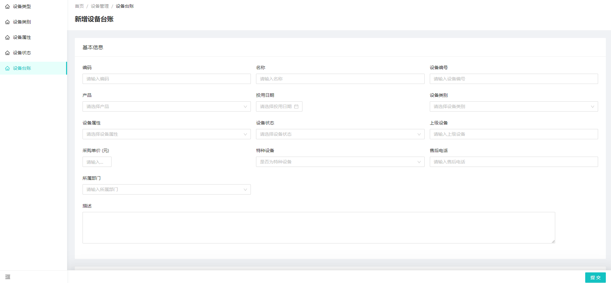

# 设备接入流程
### 1、设备接入流程图
	

### 2、设备接入操作指南（HTTP服务接入方式）

#### 1、 以智慧用电设备为例，先编写协议解析jar包。

关键代码如下：

2、上传协议包至平台，
    http://47.110.246.169/iotadmin
    目录：设备接入---协议管理
    
    点击新建
    
    上传协议解析jar包，类名需要需输入，默认的解析入口类；
    点击调试，可以进入debug调试状态；
3、创建产品
   设备管理--设备产品
   
   点击新增
      
    其中，协议要选择前面上传的协议
    传输，选择HTTP
    保存后，在列表页面，点击
      
    查看按钮，进入产品维护页面，配置产品级的物理模型、事件类型等；
      
4、管理设备
    目录：设备管理--设备实例
    
    备注：物联网平台的设备接入是依靠设备id识别设备的，请确保设备id在推送的数据中存在且唯一。
5、创建网络组件
    网络组建的作用类似于设备接入网关，平台通过软件层面实现不同接入协议的网关
    
6、创建接入网关
    接入网关的作用类似于联通网络和设备桥梁，在这可以配置不同的网关操作
    智慧用电只有信息上报操作，操作图如下
    
7、IGC系统配置使用
    IGC平台扩展了云平台的设备管理功能，这样可以忽略第4步操作，选择在IGC平台的设备管理中配置设备
    
    备注：需要注意的是，产品一定要选择对，编码等同于设备管理的设备id
    
    